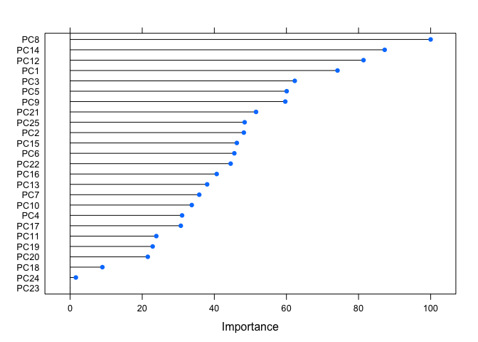

## Introduction
Recently, people can easily collect a large amount of data about personal activity via wearable devices. By diving into the data, the patterns of the behavior can be revealed. In this article, the sports data was analyzed to find the relation with sports type. In other words, classifiers should be constructed to predict sports type based on body movement data. Three types of clssifiers were tested: Random Forest, LDA and Radial SVM. The result shows Random Forest achieved best predicitve accuracy.

## Data Import and Proprocess
Two data sets are available: [training set](https://d396qusza40orc.cloudfront.net/predmachlearn/pml-training.csv) and [testing set](https://d396qusza40orc.cloudfront.net/predmachlearn/pml-testing.csv). The classifiers are construced based on the training set and tested on testing set.

According to [expriment description](http://web.archive.org/web/20161224072740/http:/groupware.les.inf.puc-rio.br/har), **classe** is the response variable, and only predictors related with body movement are concerned. Furthermore, with some simple descriptive analysis, the training set has 19622 observations and 160 variables (1 variable is used as row names). But only 406 observations are complete, which means there are many missing values and some preprocessing techniques are neccessary.

                        Ratio of NA
---------------------  ------------
roll_belt                      0.00
pitch_belt                     0.00
yaw_belt                       0.00
total_accel_belt               0.00
kurtosis_roll_belt             0.98
kurtosis_picth_belt            0.98
kurtosis_yaw_belt              1.00
skewness_roll_belt             0.98
skewness_roll_belt.1           0.98
skewness_yaw_belt              1.00

The table shows there are predictors with large portion of missing values. In fact, there are total 100 predictors in which over 95% entries are _NA_ and these predictors should be removed.  

Examined correlation among remaining predictors, it show 22 pairs predictors are correlated with correlation greater than _0.7_. Hence, PCA is applied to remove colinearity and reduce dimensionality. With 95% PVE(Proportion of Variance Explained), 25 components are kept.  

Now, the processed training set has 19622 observations and 26 variables (1 variable is _response_) with 0 missing values.

## Model Fitting
Due to CPU limitation, only part of the the training set is used to construct the classifier.
  
Testing set is not supposed to be touched during model construction and testing error rate (out of sample error) is what we concerned. Hence, cross-validation is applied. The error rate from cross-validation is the estimator of expected testing error rate.
  
Here, K-Fold is chosen considering both computation and effectiveness. 10 for the K-value is used since large K-value would introduce large variance while small K-value would introduce large bias.
  
Three kinds of models are applied:  
* LDA - creating linear decison boundary  
* Radial SVM - creating flexible and circle-like decison boundary  
* Random Forest - creating more flexible and non-linear decison boundary  

<!-- -->

       Accuracy
----  ---------
RF         0.93
SVM        0.81
LDA        0.53
  
According to the plot, the **Random Forest** model ranks top1 in both Accuracy and Kappa (multi-class metrics). Which also means the relation between response(_classe_) and principal components are highly non-linear.  

<!-- -->
  

The plot shows the variable importance of Random Forest model. Top 3 most important predictors are PC8, PC14 and PC12.

## Application on Testing Set

  
The testing set should be preprocessed in the same way as training set does.  
The accuracy of testing prediction is 95% checked by Prediction Quiz.

