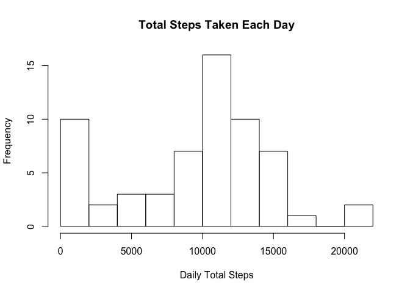
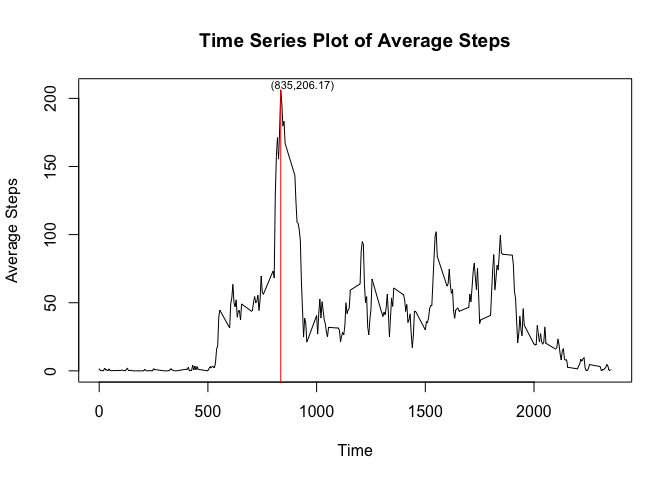
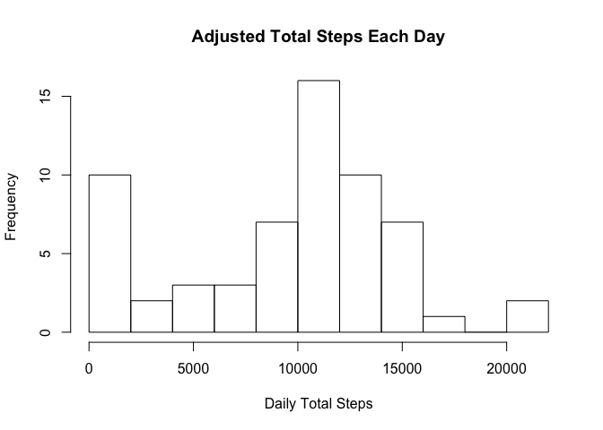
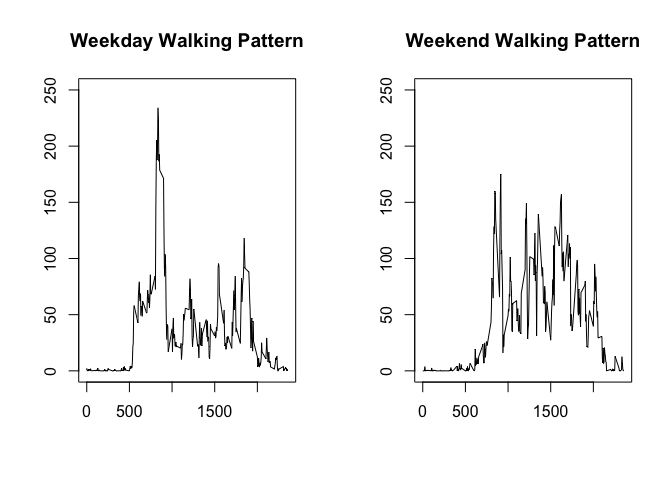

This article is for the Reproducible Research [Week 2 project](https://github.com/rdpeng/RepData_PeerAssessment1) of Data Science in Coursera. The purpose is importing and analyzing the _activity_ dataset which records the personal daily walking steps.


## Importing data

```r
datUrl <- "https://d396qusza40orc.cloudfront.net/repdata%2Fdata%2Factivity.zip"
datName <- "data/activity.zip"

# download data if data is not downloaded
if (!file.exists("data/activity.zip")) {
  dir.create("data", showWarnings = FALSE)
  download.file(datUrl, datName)
}

# import data into R environment
unzip(datName)
stepDat <- read.csv("activity.csv", colClasses = c("integer", "Date", "integer"))
```
The dataset has three variables: _steps_, _date_ and _interval_. First, we will explore the pattern of daily steps.

## Histogram of total number of steps per day

```r
attach(stepDat)
total_steps <- tapply(steps, date, sum, na.rm = TRUE)
hist(total_steps,breaks = 10,
     main = "Total Steps Taken Each Day",
     xlab = "Daily Total Steps")
```


From the plot, we can find that there are two peaks: one is around 0 and the other is around 10,000.

## Mean and median of daily steps

```r
sum_steps <- summary(total_steps)
print(sum_steps)
```
The mean value of the daily steps is 9354.2295082 and the median value is 1.0395\times 10^{4}.

## Time series plot and max values

```r
# time series plot 
avg_interval_steps <- tapply(steps, interval, mean, na.rm = TRUE)
interval_level <- unique(interval)
plot(interval_level, avg_interval_steps, type = "l",
     main = "Time Series Plot of Average Steps",
     xlab = "Time", ylab = "Average Steps")

# find max value and its interval
max_interval <- as.integer(names(avg_interval_steps)[which.max(avg_interval_steps)])
max_value <- max(avg_interval_steps)
max_label <- paste0("(",max_interval,",",round(max_value,2),")")
text(max_interval+100, max_value+3, max_label, cex = 0.7)
lines(c(max_interval,max_interval), c(max_value, -10), col = "red")
```


From the plot, we can find the max value of steps is 206.17 and its interval is 835.

## Strategy of imputing missing values
Before imputing _NA_, we need to explore the distribution of the missing values. 

```r
library(knitr)
kable(summary(stepDat))
```

         steps             date               interval    
---  ---------------  -------------------  ---------------
     Min.   :  0.00   Min.   :2012-10-01   Min.   :   0.0 
     1st Qu.:  0.00   1st Qu.:2012-10-16   1st Qu.: 588.8 
     Median :  0.00   Median :2012-10-31   Median :1177.5 
     Mean   : 37.38   Mean   :2012-10-31   Mean   :1177.5 
     3rd Qu.: 12.00   3rd Qu.:2012-11-15   3rd Qu.:1766.2 
     Max.   :806.00   Max.   :2012-11-30   Max.   :2355.0 
     NA's   :2304     NA                   NA             

```r
na_value <- as.integer(is.na(steps))
na_value_byDate <- tapply(na_value, date, sum)
na_freq_table <- table(na_value_byDate)
print(na_freq_table)
```

```
## na_value_byDate
##   0 288 
##  53   8
```
There are 2304 _NAs_ in the dataset and all of them falls in _steps_ variable. To be more specific, for each day, it has 288 records and there are total 8 days' records missing.

My strategy to impute missing values is using the daily walking pattern (in average sense, which we have calculated in time series plot) to replace the days without records.


```r
steps2 <- vector(mode = "numeric", length = length(steps))
for (i in 1:length(steps)) {
  if (is.na(steps[i])) {
    steps2[i] <- avg_interval_steps[as.character(interval[i])]
  } 
  else {
    steps2[i] <- steps[i]
  }
}
```
And we can check there is 0 NAs in the adjusted data.

## Histogram of adjusted daily steps

```r
total_steps2 <- tapply(steps2, date, sum)
hist(total_steps,breaks = 10,
     main = "Adjusted Total Steps Each Day",
     xlab = "Daily Total Steps")
```



## Comparison of weekdays and weekends walking patterns

```r
wday <- weekdays(date)
stepDat2 <- cbind(stepDat, wday)
steps_weekdays <- stepDat2[!wday %in% c("Saturday", "Sunday"),]
steps_weekends <- stepDat2[wday %in% c("Saturday", "Sunday"),]

avg_steps_weekdays <- tapply(steps_weekdays$steps, steps_weekdays$interval, mean, na.rm =TRUE)
avg_steps_weekends <- tapply(steps_weekends$steps, steps_weekends$interval, mean, na.rm = TRUE)

par(mfrow = c(1,2))
plot(interval_level, avg_steps_weekdays, type = "l",
     main = "Weekday Walking Pattern", xlab = "", ylab = "", ylim = c(0,250))
plot(interval_level, avg_steps_weekends, type = "l",
     main = "Weekend Walking Pattern", xlab = "", ylab = "",ylim = c(0,250))
```



```r
detach(stepDat)
```
From the plots, we can find that:  
* walking steps on weekdays are more variant than weekends;  
* "active period" on weekends is little bit later than weekdays. For instance, on weekdays the steps arise around interval 500, on weekends the arising trend happens around interval 600.

